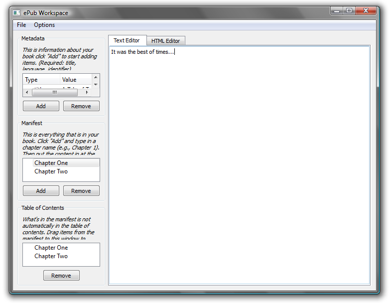

ePub Workspace
------------

ePub Workspace is a tool for creating ePub files, which can be read as electronic books on all ebook readers. This is handy when there is a lengthy web page that you want to read, but not on your screen. Examples: Robert Bolt's _[A Man for All Seasons](http://en.wikipedia.org/wiki/A_Man_For_All_Seasons)_, or C.S. Lewis's _[The Abolition of Man](http://www.columbia.edu/cu/augustine/arch/lewis/abolition1.htm)_. Of course, you're on your own to make sure the copyright is in order. Caveats:

*   You will need to overcome some awkward language to use the program.
*   The program doesn't do everything: images are not supported, for instance.



How to use it:

*   Metadata (=stuff you would find on the copyright page). Click “Add” to add a bit of metadata. You can add as much or as little as you want, except that you're obligated to add a title, language, and some identifier. The identifier can be the web site address where you got the book, for instance. Beyond that, I would also specify the creator (=author).
*   Manifest. Click “Add” to add content (like a book chapter), and give it an appropriate name. Then in the right pane, you can copy in text from a web page (or any other HTML source), and edit it as you desire.
*   Table of Contents. Don't neglect this. Drag items from the Manifest pane over to the Table of Contents pane. You can make nested tables of contents. It's quite easy to include duplicates here; use the “Remove” button liberally.
*   Select “Save ePub” from the File menu to make your ePub file.
*   To open existing ePubs, select “Open ePub” from the file menu.
*   Special options:
    *   Keep “Strip links before saving” checked to remove hyperlinks from your pasted text. (There is code in link tags that can crash an epub reader, though it's okay for browsers. This is a safeguard against that.)
    *   Keep “Embed Charis SIL” checked to have the Charis SIL font put in your epub. Its use is allowed by the Open Font License, and it looks quite nice on my reader.

Downloads
---------

ePub Workspace is created with the [Qt application framework](https://www.qt.io/), released under the GNU Public License. That means, among other things, that you are free to download it and use it, but not to re-sell it.

Qt is a cross-platform framework, so there is the possibility for using this on Mac OS X, Linux, etc. Right now I only have Windows executables because I only have a Windows machine. Perhaps some do-gooder will build versions for other operating systems and send them to me.

I build in Windows with this, which assumes that Qt is installed and visible in your path:

```
qmake -config release
mingw32-make
```

Of course your system would have something different from “mingw32-make”—probably just “make”—if you are not building from Windows using MinGW.
